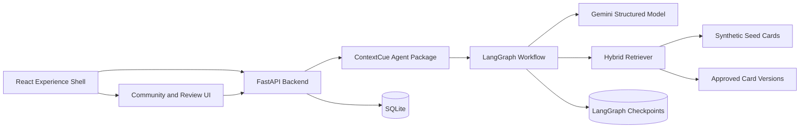

# ContextCue V2 Master Design

**Status:** Approved in conversation on 16 September 2026  
**Audience:** Hackathon implementation team and reviewers  
**Default learner language:** English  
**Initial locale:** Singapore campus environments  

## 1. Purpose

ContextCue V2 helps international students interpret ambiguous communication, identify what they do not yet know, choose a low-risk response, and practise adapting that response to relationship, channel, and formality.

The product combines four ideas as one system:

- context-aware learning is the primary learner experience;
- reviewed community context is the intended knowledge foundation;
- humour and unfamiliar expressions are one scenario family;
- direct and indirect feedback are another scenario family.

Singapore is the initial evidence scope. The product must never treat nationality as personality or present one interaction as a universal cultural rule.

## 2. Product thesis

Translation explains words. ContextCue teaches a repeatable method:

```text
Observe facts
→ identify missing context
→ compare conditional interpretations
→ clarify rather than assume
→ practise a response
→ reflect and transfer the skill
```

The differentiator is an inspectable Context Intelligence Graph supported by reviewed, multi-perspective context cards and a measurable practice loop.

## 3. Scope decomposition

V2 is delivered through four independently testable subprojects:

1. [Context Intelligence Agent](2026-09-16-context-intelligence-agent-design.md)
2. [Learning Studio](2026-09-16-learning-studio-design.md)
3. [Community Knowledge](2026-09-16-community-knowledge-design.md)
4. [Experience Shell](2026-09-16-experience-shell-design.md)

The delivery order is the order above. Each subproject must leave the application runnable and retain API v1 until its v2 replacement is verified.

## 4. System architecture



### Runtime boundaries

- `frontend/` owns rendering, interaction, local anonymous learner ID, and streaming progress consumption.
- `backend/` owns HTTP contracts, reviewer sessions, repositories, authorization, persistence, and compatibility endpoints.
- `agent/` owns LangGraph state, nodes, prompts, structured model adapter, hybrid retrieval, grounding, role-play, and learning-update decisions.
- Gemini owns bounded semantic tasks. It is not the source of truth for review status, explicit facts, session limits, or approval transitions.
- SQLite owns application state and local LangGraph checkpoints for the hackathon build.

The agent is a separate code package imported by the backend. It is not a third runtime service in V2. The boundary permits later extraction without creating additional deployment risk during the hackathon.

## 5. Shared design principles

### 5.1 Controlled workflow

LangGraph routes a typed state machine. The top-level controller is not an unrestricted ReAct loop. Model calls perform structured extraction, conditional interpretation, grounding review, simulation, and coaching within explicit graph nodes.

### 5.2 Evidence before interpretation

Every interpretation is marked as evidence-supported, contextual hypothesis, or insufficient-context. Card IDs and source IDs are validated against server-owned records.

### 5.3 Facts survive context changes

The Context Switcher may change relationship, channel, formality, or an explicitly selected hypothetical variable. It may not rewrite facts from the original situation.

### 5.4 Learning progress is observable practice evidence

The product records criteria demonstrated in ContextCue exercises. It does not claim to measure a person's overall cultural intelligence, personality, or real-world competence.

### 5.5 Review language matches actual governance

Synthetic, pending, community-reviewed, and peer-verified are distinct states. Peer-verified is unavailable until real identity verification exists.

### 5.6 Privacy by default

The product requests no names, private chat uploads, student IDs, or nationality. Community input passes privacy checks before storage. Learners may delete saved sessions.

## 6. Shared persistence model

The hackathon build uses `data/contextcue.db`.

Application tables:

- `learning_sessions`
- `context_maps`
- `practice_turns`
- `reflections`
- `skill_evidence`
- `contributions`
- `card_candidates`
- `perspectives`
- `reviews`
- `approved_card_versions`
- `card_embeddings`

LangGraph checkpoint tables live in the same SQLite database through `AsyncSqliteSaver` and are not accessed through application repositories.

The frontend stores only an anonymous `learner_id`, non-sensitive UI preferences, and transient view state in local storage.

## 7. API strategy

- API v1 remains available during V2 construction.
- New functionality uses `/api/v2`.
- Responses are versioned Pydantic artifacts.
- Long analysis exposes real graph progress through a streaming endpoint.
- Reviewer endpoints require a signed HttpOnly reviewer session.
- Public community endpoints never expose contributor IDs, reviewer notes, or internal moderation metadata.

## 8. AI and retrieval strategy

### Model adapter

Use LangChain's Gemini integration with native JSON-schema structured output. Keep the adapter behind a `StructuredModel` protocol so graph tests use deterministic fakes.

### Hybrid retrieval

- lexical ranking is always available;
- Gemini embeddings add semantic retrieval when configured;
- Reciprocal Rank Fusion combines rankings;
- metadata can boost relevant scenario, relationship, channel, and evidence status;
- eligibility gates prevent pending content from trusted retrieval;
- embeddings are cached using card version, model, dimensions, and content hash.

### Grounding

Deterministic checks validate identifiers and prohibited field leakage. A bounded structured critic finds unsupported details. The graph permits one repair. A second failure returns an evidence-only safe result.

## 9. Product surfaces

- **Explore:** search, filters, scenario library, recommendations.
- **Context Lab:** known facts, missing context, perspectives, risks, evidence, Context Switcher.
- **Response Lab:** editable clarification, confirmation, boundary, and formal strategies.
- **Practice Studio:** up to three role-play turns, coaching, retry, reflection.
- **My Learning:** session history, skill evidence, recommendations, deletion.
- **Community:** contribution, perspective collection, transparent lifecycle.
- **Review Workspace:** privacy, stereotype, evidence, counterexample, and approval checks.

## 10. Responsible AI invariants

- Never infer nationality, personality, or moral character.
- Never turn ambiguity into a cultural fact.
- Never dismiss explicit discomfort as harmless humour.
- Never invent deadlines, task owners, prior agreements, or events.
- Never label synthetic or pending content as reviewed.
- Never reveal hidden reasoning or chain-of-thought; expose only business-level graph events and evidence.
- Never allow a model output to change approval state directly.

## 11. Demo narrative

1. Explore a `can lah` teamwork situation.
2. Submit the learner's real context.
3. Watch actual graph-node progress.
4. Inspect the Context Map and evidence limitations.
5. Switch teammate to lecturer and compare changed/unchanged results.
6. Practise for two turns and revise a response.
7. Complete reflection and view new skill evidence.
8. Submit a community perspective.
9. Show the reviewer queue and approval requirements.
10. Prove pending content remains outside trusted retrieval.

## 12. Cross-project definition of done

- All four subproject definitions of done pass.
- Existing API v1 regression tests pass until migration is declared complete.
- Agent graph, frontend, repository, and API tests pass without external credentials through fakes/reference mode.
- A credentialed smoke test exercises Gemini analysis and practice.
- Authored safety evaluations pass all hard invariants.
- Docker Compose starts healthy frontend and backend services.
- Documentation distinguishes automated verification from student validation.
- Visual inspection is performed in a connected browser when available.

## 13. Explicit non-goals for V2

- A2A protocol integration.
- MCP servers.
- Multiple autonomous agents.
- Production identity verification.
- Public cloud deployment.
- Automated promotion of community content.
- Scraping private chats or social media.
- Fine-tuning a foundation model.
- Claims of measured learning impact before student testing.

## 14. Delivery risks and controls

| Risk | Control |
|---|---|
| Framework complexity delays demo | Controlled graph, one agent package, four delivery phases |
| Gemini latency | Cached retrieval, bounded model calls, visible streaming progress |
| Semantic retrieval unavailable | Lexical fallback with recorded retrieval mode |
| Hallucinated details | Typed outputs, ID validation, grounding critic, one repair, safe result |
| Fake peer claims | Strict provenance state and UI label mapping |
| Scope growth | Each subproject has its own spec, plan, tests, and acceptance gate |
